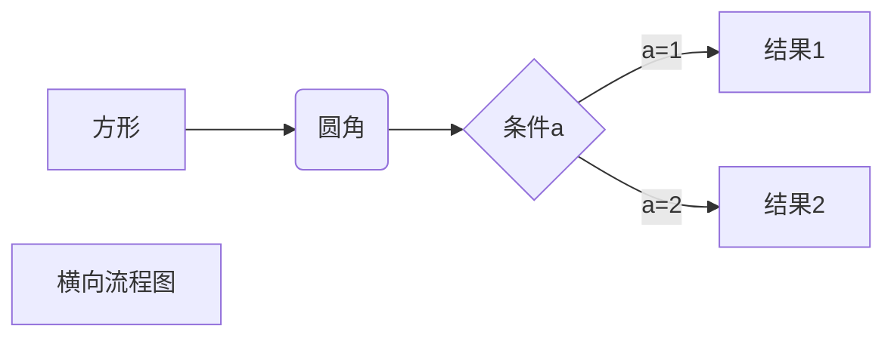
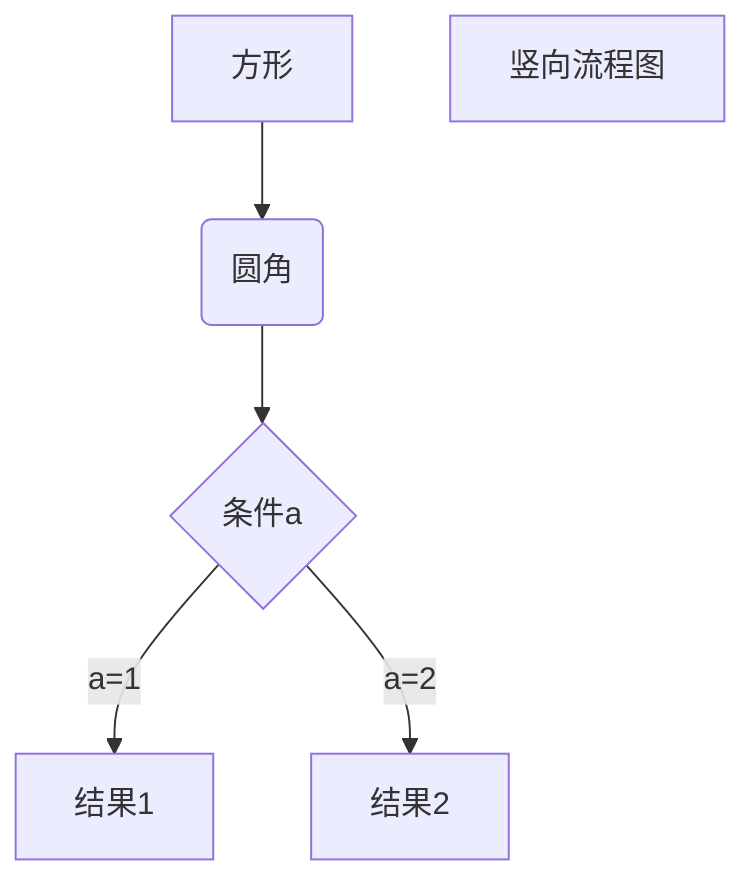
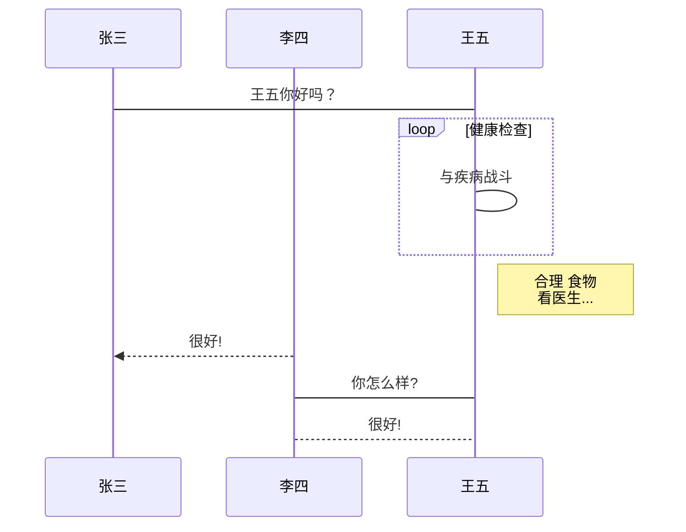

# Markdown的使用

## `[toc]` 生成目录的方式
[toc]

## 标题
使用 # 号可表示 1-6 级标题，一级标题对应一个 # 号，二级标题对应两个 # 号，以此类推 # 后面需要一个空格隔开
`# 标题内容`
# 一级标题
## 二级标题
### 三级标题
#### 四级标题
##### 五级标题
###### 六级标题

## 段落
段落的换行是使用两个以上空格加上回车 

## 字体
`*斜体文本*`
*斜体文本*

`_斜体文本_`
_斜体文本_

`**粗体文本**`
**粗体文本**

`__粗体文本__`
__粗体文本__

`***粗斜体文本***`
***粗斜体文本***

`___粗斜体文本___`
___粗斜体文本___

## 分隔线
你可以在一行中用三个以上的星号、减号、底线来建立一个分隔线，行内不能有其他东西。你也可以在星号或是减号中间插入空格。下面每种写法都可以建立分隔线：

`***`
***

`* * *`
* * *

`*****`
*****

`- - -`
- - -

## 删除线
使用两组英文~~包裹要进行删除的内容

`~~ 删除内容 ~~`
~~Markdown~~

## 下划线 
下划线可以使用html中的代码<u></u>

`<u>Markdown</u>`
<u>Markdown</u>

## 脚注
`书写格式[^要注明的文本]`

Markdown[^test]

## 列表
Markdown 支持有序列表和无序列表。
### 无序列表
无序列表使用星号(*)、加号(+)或是减号(-)作为列表标记，这些标记后面要添加一个空格，然后再填写内容


`* test1`
`* test2`
* test1
* test2
  

`+ test1`
`+ test2`
+ test1
+ test2
  
`- test1`
`- test2`
- test1
- test2

### 有序列表
有序列表使用数字并加上 . 号来表示，如：
`1. test1`
`2. test2`
1. test1
2. test2

### 列表嵌套

1. 第一项：
    - 第一项嵌套的第一个元素
    - 第一项嵌套的第二个元素
2. 第二项：
    - 第二项嵌套的第一个元素
    - 第二项嵌套的第二个元素

## 区块
Markdown 区块引用是在段落开头使用 > 符号 ，然后后面紧跟一个空格符号：
`> test1  `
> test1  
> test2

## 代码

使用\```代码内容\``` 进行包裹代码 并指定一种语言（也可以不指定）

```javascript
$(document).ready(function () {
    alert('RUNOOB');
});
```

## 链接
链接使用方法如下：

`[链接名称](链接地址) 或者 <链接地址>`

[百度](https://wwww.baidu.com)

<https://wwww.baidu.com>

### 声明变量在引用链接的方式
`[声明变量]:链接地址` `[变量调用]`

[test]:https://wwww.baidu.com

[test]

## 图片 
``
<!--  -->

``

<!--  -->

### 声明变量在引用该图片
也可以像网址那样对图片网址使用变量
[test2]:https://i.loli.net/2021/03/15/yu9YzQwGB4iXlv3.jpg

[test2]
>Markdown 还没有办法指定图片的高度与宽度，如果你需要的话，你可以使用普通的 `` 标签。


## 表格
Markdown 制作表格使用 | 来分隔不同的单元格，使用 - 来分隔表头和其他行。

语法格式如下：
```
| 表头   | 表头   |
| ------ | ------ |
| 单元格 | 单元格 |
| 单元格 | 单元格 |
```

| 表头   | 表头   |
| ------ | ------ |
| 单元格 | 单元格 |
| 单元格 | 单元格 |

### 表格对齐方式

我们可以设置表格的对齐方式：

-: 设置内容和标题栏居右对齐。
:- 设置内容和标题栏居左对齐。
:-: 设置内容和标题栏居中对齐。
实例如下：
```
| 左对齐 | 右对齐 | 居中对齐 |
| :----- | -----: | :------: |
| 单元格 | 单元格 |  单元格  |
| 单元格 | 单元格 |  单元格  |
```

| 左对齐 | 右对齐 | 居中对齐 |
| :----- | -----: | :------: |
| 单元格 | 单元格 |  单元格  |
| 单元格 | 单元格 |  单元格  |

## Markdown 高级技巧
支持的 HTML 元素
不在 Markdown 涵盖范围之内的标签，都可以直接在文档里面用 HTML 撰写。

目前支持的 HTML 元素有：`<kbd> <b> <i> <em> <sup> <sub> <br>`等 ，如：

使用 `<kbd>Ctrl</kbd>+<kbd>Alt</kbd>+<kbd>Del</kbd>` 重启电脑
使用 <kbd>Ctrl</kbd>+<kbd>Alt</kbd>+<kbd>Del</kbd> 重启电脑

## 转义
Markdown 使用了很多特殊符号来表示特定的意义，如果需要显示特定的符号则需要使用转义字符，Markdown 使用反斜杠转义特殊字符：

**文本加粗** 
\*\* 正常显示星号 \*\*

## 数学公式使用$$$$ 进行包裹

## 流程图
1. 横向流程图源码格式：
```标记语言为：`mermaid ` ```
```
graph LR
A[方形] -->B(圆角)
    B --> C{条件a}
    C -->|a=1| D[结果1]
    C -->|a=2| E[结果2]
    F[横向流程图 ]
```

2. 竖向流程图源码格式：
```标记语言为：`mermaid ` ```
```
graph TD
A[方形] --> B(圆角)
    B --> C{条件a}
    C --> |a=1| D[结果1]
    C --> |a=2| E[结果2]
    F[竖向流程图]
```


3. 标准流程图源码格式：
```标记语言为：`flow ` ```
```
st=>start: 开始框
op=>operation: 处理框
cond=>condition: 判断框(是或否?)
sub1=>subroutine: 子流程
io=>inputoutput: 输入输出框
e=>end: 结束框
st->op->cond
cond(yes)->io->e
cond(no)->sub1(right)->op
```

```flow
st=>start: 开始框
op=>operation: 处理框
cond=>condition: 判断框(是或否?)
sub1=>subroutine: 子流程
io=>inputoutput: 输入输出框
e=>end: 结束框
st->op->cond
cond(yes)->io->e
cond(no)->sub1(right)->op
```
4. 标准流程图源码格式（横向）：

```flow
st=>start: 开始框
op=>operation: 处理框
cond=>condition: 判断框(是或否?)
sub1=>subroutine: 子流程
io=>inputoutput: 输入输出框
e=>end: 结束框
st(right)->op(right)->cond
cond(yes)->io(bottom)->e
cond(no)->sub1(right)->op
```
5. UML时序图源码样例：
```标记语言为：`sequence ` ```
```sequence
对象A->对象B: 对象B你好吗?（请求）
Note right of 对象B: 对象B的描述
Note left of 对象A: 对象A的描述(提示)
对象B-->对象A: 我很好(响应)
对象A->对象B: 你真的好吗？
```
6. UML时序图源码复杂样例：

```sequence
Title: 标题：复杂使用
对象A->对象B: 对象B你好吗?（请求）
Note right of 对象B: 对象B的描述
Note left of 对象A: 对象A的描述(提示)
对象B-->对象A: 我很好(响应)
对象B->小三: 你好吗
小三-->>对象A: 对象B找我了
对象A->对象B: 你真的好吗？
Note over 小三,对象B: 我们是朋友
participant C
Note right of C: 没人陪我玩
```
7. UML标准时序图样例：
```标记语言为：`mermaid ` ```

8. 甘特图样例：

```gantt         
dateFormat  YYYY-MM-DD   
title 使用mermaid语言定制甘特图

section 任务1
已完成的任务           :done,    des1, 2014-01-06,2014-01-08
正在进行的任务               :active,  des2, 2014-01-09, 3d
待完成任务1               :         des3, after des2, 5d
待完成任务2              :         des4, after des3, 5d

section 关键任务
已完成的关键任务 :crit, done, 2014-01-06,24h
已完成的关键任务2         :crit, done, after des1, 2d
正在进行的关键任务             :crit, active, 3d
待完成的关键任务        :crit, 5d
待完成任务           :2d
待完成任务2                      :1d

section 文档编写
描述甘特图语法               :active, a1, after des1, 3d
完成甘特图实例1      :after a1  , 20h
完成甘特图实例2    :doc1, after a1  , 48h
```

**注意：有部分Markdow语法在网页上无法正常显示 ，只适用于笔记中查看**

